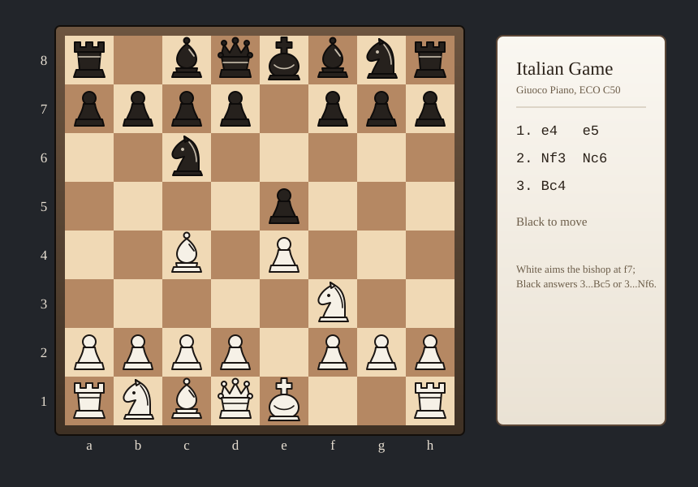
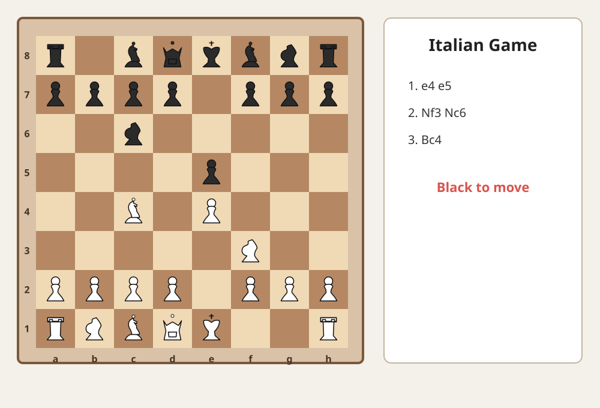
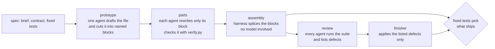

# Swarm Workbench

**A 20-agent Gemini 3.8 Flash swarm, measured head to head against one Claude Opus 5 agent.**

Same brief, same fixed acceptance tests, same judge. Every number below comes from a recorded run:
token counts from the CLI stats and API usage blocks, dollars from the providers' list prices.

<!-- trailer -->

---

## The short version

| | 20-agent Gemini swarm | 1 Opus agent |
|---|---|---|
| Passes the fixed tests | always | always |
| Cost per artifact | **$5.31 - $8.31** (intro pricing), $10.61 - $16.62 from 2027 | **$2.40 - $8.30**, and that includes writing the spec and the tests |
| Clean head to head, city skyline | $5.31, 269 elements, 36 min | **$2.74, 2,145 elements, 9 min** |
| Where it wins | the pelican: 606 elements vs 135 | the chessboard, the city skyline |

On today's evidence the swarm is **not** cheaper, faster or richer than a single strong agent. It uses about
20x the tokens at about 6.7x lower price per token, so it costs roughly twice as much, and four times as much
once Gemini's introductory price ends. What the swarm work did produce is a harness that divides labour for
real, and a set of measurements that show exactly where the tokens go.

---

## Side by side

Left: one Opus agent. Right: what the swarm shipped.

<table>
<tr><th>Pelican riding a bike on the beach</th><th></th></tr>
<tr>
<td></td>
<td></td>
</tr>
<tr><td>Opus: 11/11 tests, 135 elements</td><td>Swarm (parts pipeline): 11/11 tests, 606 elements, $7.15</td></tr>

<tr><th>City at dusk across the river</th><th></th></tr>
<tr>
<td></td>
<td></td>
</tr>
<tr><td>Opus, measured run: 14/14 tests, 2,145 elements, $2.74, 9 min</td><td>Swarm: 14/14 tests, 269 elements, $5.31, 36 min</td></tr>

<tr><th>Chess opening diagram</th><th></th></tr>
<tr>
<td></td>
<td></td>
</tr>
<tr><td>Opus: 14/14 tests, 275 elements</td><td>Swarm: 14/14 tests, 191 elements, $6.11</td></tr>
</table>

The animated canvas briefs cannot render inside a README; open them locally:
[solar system, swarm](bench/results/html/solar-system-swarm.html) vs [Opus](bench/results/html/solar-system-opus.html),
[galaxy, swarm](bench/results/html/galaxy-swarm.html) vs [Opus](bench/results/html/galaxy-opus.html).

---

## Every run

| Brief | Run | Harness | Tests swarm / Opus | Material swarm / Opus | Swarm tokens | Swarm cost (intro / 2027) | Opus cost | Swarm time |
|---|---|---|---|---|---|---|---|---|
| Pelican | `60dd4052` | whole-file rounds | 11/11 / 11/11 | 291 / 135 elements | 37,699,151 | $8.31 / $16.62 | not isolated | 43 min |
| Galaxy "6" | `0abd17a2` | whole-file rounds | 11/11 / 11/11 | 10.1k / 6.2k script chars | 35,532,096 | $7.52 / $15.03 | not isolated | 45 min |
| Pelican | `e202273f` | parts | 11/11 / 11/11 | 606 / 135 elements | 34,625,727 | $7.15 / $14.29 | not isolated | 40 min |
| Solar system | `fe20a125` | parts + stage caps | 14/14 / 14/14 | 15.3k / 11.2k script chars | 28,387,157 | $6.38 / $12.75 | $2.88 * | 39 min |
| Chess opening | `130f4288` | parts + stage caps | 14/14 / 14/14 | 191 / 275 elements | 26,334,050 | $6.11 / $12.23 | $2.74 * | 35 min |
| City skyline | `de1a4acd` | parts + frugal review | 14/14 / 14/14 | 269 / 2,145 elements | 20,425,613 | $5.31 / $10.61 | **$2.74** | 36 min |

\* Opus job that also wrote the spec and its test suite. The city skyline Opus figure is a dedicated,
artifact-only run built from the spec alone, measured the same way.

"Material" is a crude stand-in, because the tests check structure and not looks: SVG element count, or script
length for canvas pages.

---

## The cost math

List prices, read from the official pages on 2026-09-12:

| Model | Input | Cached input | Cache write | Output |
|---|---|---|---|---|
| Claude Opus 5 | $5.00 / MTok | $0.50 | $6.25 (5 min), $10.00 (1 h) | $25.00 |
| Gemini 3.8 Flash, introductory until 2026-12-31 | $0.75 | $0.075 | - | $3.75 |
| Gemini 3.8 Flash, standard from 2027-01-01 | $1.50 | $0.15 | - | $7.50 |

Worked example, the city skyline:

| | fresh input | cached input / cache read | cache write | output (incl. thinking) | total |
|---|---|---|---|---|---|
| Swarm, 39 Gemini calls | 3,526,883 | 16,519,814 | - | 378,916 | **$5.31** |
| Opus, 12 API calls | 24 | 1,104,206 | 197,096 | 38,333 | **$2.74** |

Caching is already in these figures: it is the largest line on both sides. The swarm reads about 20x more
context than the single agent, and a 10x cheaper cache price does not close that gap.

Reproduce: `python bench/cost_report.py` (add `--standard` for 2027 prices).

---

## What was measured, and what changed because of it

| # | Measured | Changed |
|---|---|---|
| 1 | Whole-file rounds: 15 agents drew 15 complete pelicans, and the integrator shipped one of them almost byte for byte (36 of 36 ids, nothing added) | Owned parts: a prototype cuts the file into named blocks, each agent may only return its own block, the harness splices them |
| 2 | Startup before any division of labour: 86.8% and 92.7% of all tokens | A single prototype call: 2.9% - 10.3% |
| 3 | Agent pairs sharing at least half of what they produce: 21 of 78, 28 of 91 | 0 in every parts run |
| 4 | The build stage spent the whole cap and all 20 reviews were refused | Per-stage ceilings: build stops at 60% of the cap, reviews at 85%, the finisher always runs |
| 5 | 37 tool calls and 1.37M tokens per part agent, mostly re-reading the board | Read only new posts, plus a `verify.py` that runs the real tests on the agent's block: 0.77M - 0.94M |
| 6 | A review cost 0.75M - 0.92M tokens | Frugal review turn (run the suite once, no rebuilding): 0.18M |
| 7 | Two swarms on one key hit the 2M input tokens / minute quota and lost 5 of 10 agents | `bench/queue_swarms.sh` runs swarms strictly one at a time |
| 8 | Agents died after writing their block but before answering | The harness salvages the block file they left on disk |
| 9 | The fixed tests cannot tell the drafts apart: prototype, assembly and final all pass | The tests pick between the assembly and the finisher's version, never the last agent to speak |

---

## How the swarm works



- **Board.** A shared directory, one file per post: plans, notes, the draft, the assembly, the test suite.
- **Budget tool.** `python board/budget.py` shows every agent the live spend against its stage budget.
- **Sandbox.** One Docker container per swarm, non-root, with the API key passed by name only; acceptance
  runs with the network off. Container mode needs `GEMINI_API_KEY` in `.env`; `SWARM_AGENT_SANDBOX=docker`
  refuses to fall back to the host.
- **Trace.** Built on [Super Simple Software Factory](https://github.com/disler/super-simple-software-factory):
  every phase, tool call and board post lands in a SQLite trace, with a terminal monitor and a web UI.

---

## Run it

Requirements: Python 3.12, [just](https://github.com/casey/just), Node 22+, Gemini CLI 0.59+, Docker Desktop
for the sandbox.

```bash
just swarm prompts/09-city-skyline.json           # one swarm
bash bench/queue_swarms.sh prompts/0*.json         # several, strictly one at a time
just monitor                                       # live terminal view
just swarm-ui                                      # web UI on http://127.0.0.1:5178
```

Measure and compare:

```bash
python bench/measure_run.py <run_id>               # startup share, division of labour, overlap
python bench/compare_to_baseline.py <run_id>       # swarm vs Opus baseline on the same tests
python bench/cost_report.py                        # dollars for every swarm run and Opus job
python bench/check_specs.py                        # a spec's tests must pass its baseline and fail an empty file
python bench/check_swarm_dry.py                    # the whole pipeline end to end, zero tokens
```

## The briefs

Twelve specs in [`prompts/`](prompts), each with a 20-agent roster, a contract and 11 - 14 fixed tests that
pass on an Opus baseline in [`bench/baselines/`](bench/baselines) and fail on an empty file:
pelican, galaxy, metro map, solar system, chess opening, city skyline, audio visualizer, clock mechanism,
isometric study, rain window, regatta, fractal garden. How to write a new one:
[`bench/spec-authoring.md`](bench/spec-authoring.md).

## Limits of these numbers

- One run per brief, so no variance.
- In the benchmark runs the agents executed on the host, because no API key was available inside the
  container; later acceptance runs also executed on the host while Docker was down.
- The tests check structure, not beauty. Look at the pictures.
- Gemini dollars come from the CLI's recorded stats, and agents killed before they reported are missing, so
  the provider console shows a higher total than `cost_report.py`.
- The pelican and galaxy Opus baselines were drawn inside a longer session and could not be isolated.

## Credits

Built on [Super Simple Software Factory](https://github.com/disler/super-simple-software-factory) by
IndyDevDan, MIT licensed (see [`LICENSE-SSSF`](LICENSE-SSSF)).
