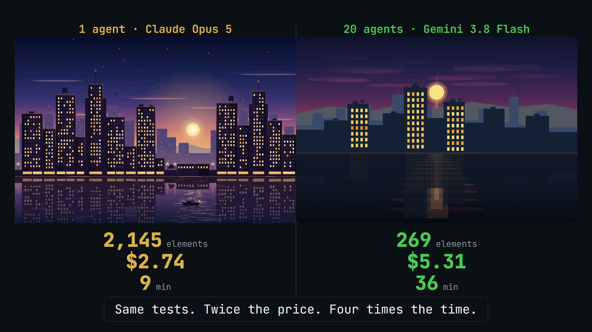
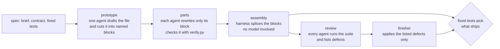

# Swarm Workbench

**A 20-agent Gemini 3.8 Flash swarm, measured head to head against one Claude Opus 5 agent.**

Same brief, same fixed acceptance tests, same judge. Every number below comes from a recorded run:
token counts from the CLI stats and API usage blocks, dollars from the providers' list prices.

[](brag-output/brag.mp4)
<br><sub>20-second trailer. Click the image to play the video.</sub>

---

## The short version

| | 20-agent Gemini swarm | 1 Opus agent |
|---|---|---|
| Passes the fixed tests | always | always |
| Cost per artifact | **$5.31 - $8.31** (intro pricing), $10.61 - $16.62 from 2027 | **$2.40 - $8.30**, and that includes writing the spec and the tests |
| Clean head to head, city skyline | $5.31, 269 elements, 36 min | **$2.74, 2,145 elements, 9 min** |
| Where it wins | the pelican: 606 elements vs 135 | the chessboard, the city skyline |

On today's evidence the swarm is **not** cheaper, faster or richer than a single strong agent. It uses about
20x the tokens at about 6.7x lower price per token, so it costs roughly twice as much, and four times as much
once Gemini's introductory price ends. What the swarm work did produce is a harness that divides labour for
real, and a set of measurements that show exactly where the tokens go.

## Round two: free models, project-sized briefs (2026-09-14)

The harness now drives any coding-agent CLI (`adws/adw_modules/runners/`: gemini, agy, opencode, kilo,
cline, codex, claude, copilot) or a raw OpenAI-compatible endpoint with its own tool loop (`nim`, NVIDIA
NIM, added 2026-09-15 after every free CLI gateway went dark the same night: opencode Zen hung with zero
bytes on both streams, cline hit its daily cap, kilo took 256 s per trivial call). The swarm ran on free
models against two new briefs, each a one-page web app with 12 features and 14 fixed tests
(`prompts/16-budget-ledger.json`, `17-markdown-notebook.json`).

| brief | 1 x Opus 5 | 1 x free model (big-pickle) | 20 x free swarm |
|---|---|---|---|
| budget ledger | 12/12, 3 min 35 s, $1.10 | 12/12, 21 min 41 s, $0 | 12/12 at assembly, ~54 min, 11.2M tokens, $0 (run `4695d87e`, died at the finisher when the laptop ran out of memory) |
| markdown notebook | 12/12, 6 min 41 s, $2.03 | 12/12, 3 min 14 s, $0 | 12/12 accepted, 48 min, 11.1M tokens, $0 (run `b778d291`, muse-spark for the two whole-file turns) |
| budget ledger, DeepSeek V4 Flash owners | - | 0/12 (cannot write the file in one turn: output cap) | 12/12 accepted, 41 min, 10.5M tokens, $0 (run `4121c220`: the 12 feature blocks written by a model that scores 0 alone; muse-spark prototype and finisher; cline's daily cap then killed the 4 infrastructure owners and every review) |

Same tests, zero dollars, and the free soloist gets there too, faster. What decided the runs was the
models' output cap, not their reasoning: DeepSeek V4 Flash and big-pickle both die writing a 40 KB file
in one turn, so the harness now takes every deliverable from disk and can run the prototype and the
finisher on a large-output model while the 16 owners write small blocks on anything. Full tables,
frictions and the provider survey: [`bench/results/free-swarm-2026-09-14.md`](bench/results/free-swarm-2026-09-14.md),
[`bench/providers-2026-09-14.md`](bench/providers-2026-09-14.md).

A green suite is not a working page. On 2026-09-16 the same free soloist that scores 18/18 on a
16-feature kanban brief shipped a page with 14 of 16 panels empty, and another one whose New Note
button throws; the fixed suites judge pure model functions in node and never open the page. The
harness now does: `adws/adw_modules/ui_gate.py` loads the assembled file in a headless browser, seeds
its store through the contract, and every empty panel or mount error becomes a defect the finisher
must fix; among test-passing candidates the one whose page also works ships. Verdicts per build in
[`bench/results/ui-verdicts-2026-09-16.md`](bench/results/ui-verdicts-2026-09-16.md); the policy that
falls out of every ladder (one agent first, the swarm only when the two gates are red) is
`bench/solo_first.py`.

The scaling question itself (does size 1, 2, 5, 10 or 20 of the same free model score more on the
same brief, and at what token cost) is measured on the 19-test secure-server brief in
[`bench/results/nim-sweep-2026-09-15.md`](bench/results/nim-sweep-2026-09-15.md): the first night's
ladder read 4/19 -> 11/19 -> 18/19 from size 2 to 10 with half the owners lost to the provider's
rate limit, and the size-10 board holds the first cross-block defect reports (a wrong return shape,
a broken `escapeHtml`) that reviewers addressed to the right owner by name. The re-run with the runner
throttled and an `edit_file` tool got as far as size 10 before the provider's queue (two completions
a minute, 160 refusals in one run) made the ladder a measurement of the queue: the same soloist that
scored 18/19 in 9 minutes at 04:38 could not finish in 31 at 08:49. Five free NIM models were tried on
the brief; only nemotron-super does it, and it is the congested one. The runner, the harness fixes
and a one-command relaunch are ready for any OpenAI-compatible endpoint that answers.

---

## Side by side

Left: one Opus agent. Right: what the swarm shipped.

<table>
<tr><th>Pelican riding a bike on the beach</th><th></th></tr>
<tr>
<td></td>
<td></td>
</tr>
<tr><td>Opus: 11/11 tests, 135 elements</td><td>Swarm (parts pipeline): 11/11 tests, 606 elements, $7.15</td></tr>

<tr><th>City at dusk across the river</th><th></th></tr>
<tr>
<td></td>
<td></td>
</tr>
<tr><td>Opus, measured run: 14/14 tests, 2,145 elements, $2.74, 9 min</td><td>Swarm: 14/14 tests, 269 elements, $5.31, 36 min</td></tr>

<tr><th>Chess opening diagram</th><th></th></tr>
<tr>
<td></td>
<td></td>
</tr>
<tr><td>Opus: 14/14 tests, 275 elements</td><td>Swarm: 14/14 tests, 191 elements, $6.11</td></tr>
</table>

The animated canvas briefs cannot render inside a README; open them locally:
[solar system, swarm](bench/results/html/solar-system-swarm.html) vs [Opus](bench/results/html/solar-system-opus.html),
[galaxy, swarm](bench/results/html/galaxy-swarm.html) vs [Opus](bench/results/html/galaxy-opus.html).

---

## Every run

| Brief | Run | Harness | Tests swarm / Opus | Material swarm / Opus | Swarm tokens | Swarm cost (intro / 2027) | Opus cost | Swarm time |
|---|---|---|---|---|---|---|---|---|
| Pelican | `60dd4052` | whole-file rounds | 11/11 / 11/11 | 291 / 135 elements | 37,699,151 | $8.31 / $16.62 | not isolated | 43 min |
| Galaxy "6" | `0abd17a2` | whole-file rounds | 11/11 / 11/11 | 10.1k / 6.2k script chars | 35,532,096 | $7.52 / $15.03 | not isolated | 45 min |
| Pelican | `e202273f` | parts | 11/11 / 11/11 | 606 / 135 elements | 34,625,727 | $7.15 / $14.29 | not isolated | 40 min |
| Solar system | `fe20a125` | parts + stage caps | 14/14 / 14/14 | 15.3k / 11.2k script chars | 28,387,157 | $6.38 / $12.75 | $2.88 * | 39 min |
| Chess opening | `130f4288` | parts + stage caps | 14/14 / 14/14 | 191 / 275 elements | 26,334,050 | $6.11 / $12.23 | $2.74 * | 35 min |
| City skyline | `de1a4acd` | parts + frugal review | 14/14 / 14/14 | 269 / 2,145 elements | 20,425,613 | $5.31 / $10.61 | **$2.74** | 36 min |

\* Opus job that also wrote the spec and its test suite. The city skyline Opus figure is a dedicated,
artifact-only run built from the spec alone, measured the same way.

"Material" is a crude stand-in, because the tests check structure and not looks: SVG element count, or script
length for canvas pages.

---

## The cost math

List prices, read from the official pages on 2026-09-12:

| Model | Input | Cached input | Cache write | Output |
|---|---|---|---|---|
| Claude Opus 5 | $5.00 / MTok | $0.50 | $6.25 (5 min), $10.00 (1 h) | $25.00 |
| Gemini 3.8 Flash, introductory until 2026-12-31 | $0.75 | $0.075 | - | $3.75 |
| Gemini 3.8 Flash, standard from 2027-01-01 | $1.50 | $0.15 | - | $7.50 |

Worked example, the city skyline:

| | fresh input | cached input / cache read | cache write | output (incl. thinking) | total |
|---|---|---|---|---|---|
| Swarm, 39 Gemini calls | 3,526,883 | 16,519,814 | - | 378,916 | **$5.31** |
| Opus, 12 API calls | 24 | 1,104,206 | 197,096 | 38,333 | **$2.74** |

Caching is already in these figures: it is the largest line on both sides. The swarm reads about 20x more
context than the single agent, and a 10x cheaper cache price does not close that gap.

Reproduce: `python bench/cost_report.py` (add `--standard` for 2027 prices).

### Reconciled against the real AI Studio bill

`cost_report.py` originally totaled **$51.35** (introductory pricing) across every Gemini swarm run, well
below the ~67 EUR the AI Studio spend page showed. The gap had a concrete cause, not a vague "some agents
got killed": every swarm launched before 2026-09-11 (11 of the 25 runs in the trace db, including the first
pelican attempt) ran through the **agy** (Antigravity) runner on `gemini-3.8-flash-medium`, whose per-agent
usage logs are shaped `{"event": "result", "result": {"usage": {...}}}` instead of the Gemini CLI's
`{"type": "result", "stats": {...}}`. `cost_report.py` only ever matched the second shape, so those 11 runs'
real, billed tokens (64 calls, 6.3M fresh input, 28.1M cached input, 2.0M output) were silently counted as
**$0**, not estimated low. Fixed in `bench/cost_report.py` to parse both shapes; the corrected total is
**$65.61** at introductory pricing - within about 2% of the ~67 figure, whether that figure is USD or EUR.

What's left of the gap is one confirmed zero (run `994b4121`: every agent died before writing any usage at
all, so its real cost is unknown, not zero) plus the tail of three swarms still `running` when this was
measured. Both are consistent with the remaining few dollars, and neither is estimable from what's on disk.

---

## What was measured, and what changed because of it

| # | Measured | Changed |
|---|---|---|
| 1 | Whole-file rounds: 15 agents drew 15 complete pelicans, and the integrator shipped one of them almost byte for byte (36 of 36 ids, nothing added) | Owned parts: a prototype cuts the file into named blocks, each agent may only return its own block, the harness splices them |
| 2 | Startup before any division of labour: 86.8% and 92.7% of all tokens | A single prototype call: 2.9% - 10.3% |
| 3 | Agent pairs sharing at least half of what they produce: 21 of 78, 28 of 91 | 0 in every parts run |
| 4 | The build stage spent the whole cap and all 20 reviews were refused | Per-stage ceilings: build stops at 60% of the cap, reviews at 85%, the finisher always runs |
| 5 | 37 tool calls and 1.37M tokens per part agent, mostly re-reading the board | Read only new posts, plus a `verify.py` that runs the real tests on the agent's block: 0.77M - 0.94M |
| 6 | A review cost 0.75M - 0.92M tokens | Frugal review turn (run the suite once, no rebuilding): 0.18M |
| 7 | Two swarms on one key hit the 2M input tokens / minute quota and lost 5 of 10 agents | `bench/queue_swarms.sh` runs swarms strictly one at a time |
| 8 | Agents died after writing their block but before answering | The harness salvages the block file they left on disk |
| 9 | The fixed tests cannot tell the drafts apart: prototype, assembly and final all pass | The tests pick between the assembly and the finisher's version, never the last agent to speak |

---

## How the swarm works



- **Board.** A shared directory, one file per post: plans, notes, the draft, the assembly, the test suite.
  `thread.md` is the single group conversation; a post names who it concerns with `@agent` or `@all`.
- **Coordination tools** (`SWARM_COORD=1`). The agent CALLS these, instead of being handed a frozen
  snapshot: `python board/swarm.py <cmd> --as <agent>` with `inbox` (messages since you last looked),
  `team` (who exists, what they hold, who is done), `claim <file> [seconds]` / `release` / `claims`
  (a file lease that EXPIRES, so a dead agent cannot deadlock the swarm), `history <file>` (who held
  it, how old it is on disk), `render <file>` (headless browser: does the page actually come up),
  `done <file> <why>`, `budget`. An owner that never delivers and never calls `done` gets one more turn.
- **Budget tool.** `python board/budget.py` shows every agent the live spend against its stage budget.
- **Sandbox.** One Docker container per swarm, non-root, with the API key passed by name only; acceptance
  runs with the network off. Container mode needs `GEMINI_API_KEY` in `.env`; `SWARM_AGENT_SANDBOX=docker`
  refuses to fall back to the host.
- **Trace.** Built on [Super Simple Software Factory](https://github.com/disler/super-simple-software-factory):
  every phase, tool call and board post lands in a SQLite trace, with a terminal monitor and a web UI.

---

## Run it

Requirements: Python 3.12, [just](https://github.com/casey/just), Node 22+, and one provider: an
`NVIDIA_API_KEY` in `.env` for the free NIM models (no CLI needed), or one coding-agent CLI (opencode,
kilo or cline for their free models; gemini, agy, codex, claude, copilot for paid plans). Docker Desktop
for the sandbox.

```bash
just swarm prompts/09-city-skyline.json           # one swarm, on SWARM_RUNNER / SWARM_MODEL (default gemini)
SWARM_RUNNER=nim SWARM_MODEL=nvidia/nemotron-3-super-120b-a12b \
  bash bench/scale_sweep.sh prompts/18-secure-server.json 1 2 5 10 20   # same brief, sizes 1 to 20, provider preflight first
SWARM_RUNNER=opencode SWARM_MODEL=opencode/big-pickle \
SWARM_WHOLE_FILE_MODEL=opencode/muse-spark-1.3-contributor-free \
  bash bench/queue_swarms.sh prompts/17-markdown-notebook.json   # free swarm; large-output model for the two whole-file turns
python bench/solo_run.py prompts/16-budget-ledger.json opencode  # the same brief, one agent alone, same judge
python bench/check_runner.py nim nvidia/nemotron-3-super-120b-a12b   # one real call through a runner, hello.txt + envelope
python bench/nim_models.py                        # which NIM models answer, how fast, and whether they call tools
python bench/solo_first.py prompts/19-kanban-board.json opencode opencode/muse-spark-1.3-contributor-free --repair
                                                  # one agent, then tests + the browser gate; up to 3 repair turns
                                                  # on red, a turn kept only if it scores higher; without --repair
                                                  # the swarm takes the brief instead
python bench/ui_gate.py work/webtest/*.html       # does every panel render, does the page throw on load
just monitor                                       # live terminal view
just swarm-ui                                      # web UI on http://127.0.0.1:5178
```

Measure and compare:

```bash
python bench/measure_run.py <run_id>               # startup share, division of labour, overlap
python bench/compare_to_baseline.py <run_id>       # swarm vs Opus baseline on the same tests
python bench/cost_report.py                        # dollars for every swarm run and Opus job
python bench/check_specs.py                        # a spec's tests must pass its baseline and fail an empty file
python bench/check_swarm_dry.py                    # the whole pipeline end to end, zero tokens
```

## The briefs

Twelve specs in [`prompts/`](prompts), each with a 20-agent roster, a contract and 11 - 14 fixed tests that
pass on an Opus baseline in [`bench/baselines/`](bench/baselines) and fail on an empty file:
pelican, galaxy, metro map, solar system, chess opening, city skyline, audio visualizer, clock mechanism,
isometric study, rain window, regatta, fractal garden. How to write a new one:
[`bench/spec-authoring.md`](bench/spec-authoring.md).

The one-shot app briefs get harder in order, and the later ones carry a click scenario the browser gate
replays: 16 budget ledger and 17 markdown notebook (12 features, 14 tests), 18 secure server (19 HTTP
tests), 19 kanban board (16 features, 18 tests, 14 clicks), 20 spreadsheet (20 features, 22 tests, 17
clicks: a formula parser and evaluator with cross-sheet references, named ranges, a dependency graph
with cycle detection, six error codes, reference rewriting on row and column insertion, fill series,
CSV, an SVG chart, validation, conditional formatting, undo fifty deep and a versioned store). Each spec
is built by `work/spec<N>/build_spec.py` from its test file and scenario, and checked by
`bench/check_specs.py` (baseline passes, empty page fails). Spec 20 also carries a `skeleton`: the
contract made concrete (store, router, commit helpers, mount, one empty block per feature).
`SWARM_SKELETON=1` makes it the draft and skips the prototype turn, which on a 2,000-line brief no
free model finishes in one stream (cline cuts at about twelve minutes, the nim loop at its step
cap); a reduced roster gets the twenty blocks regrouped into one contiguous block per owner.

## Limits of these numbers

- One run per brief, so no variance.
- In the benchmark runs the agents executed on the host, because no API key was available inside the
  container; later acceptance runs also executed on the host while Docker was down.
- The tests check structure, not beauty. Look at the pictures.
- Gemini dollars come from each agent's recorded usage; one run (`994b4121`) has none on disk at all because
  every agent in it died before logging any, so it prices as $0 rather than its real, unknown cost. See
  "Reconciled against the real AI Studio bill" above for the rest of the gap against the provider console.
- The pelican and galaxy Opus baselines were drawn inside a longer session and could not be isolated.

## Credits

Built on [Super Simple Software Factory](https://github.com/disler/super-simple-software-factory) by
IndyDevDan, MIT licensed (see [`LICENSE-SSSF`](LICENSE-SSSF)).
